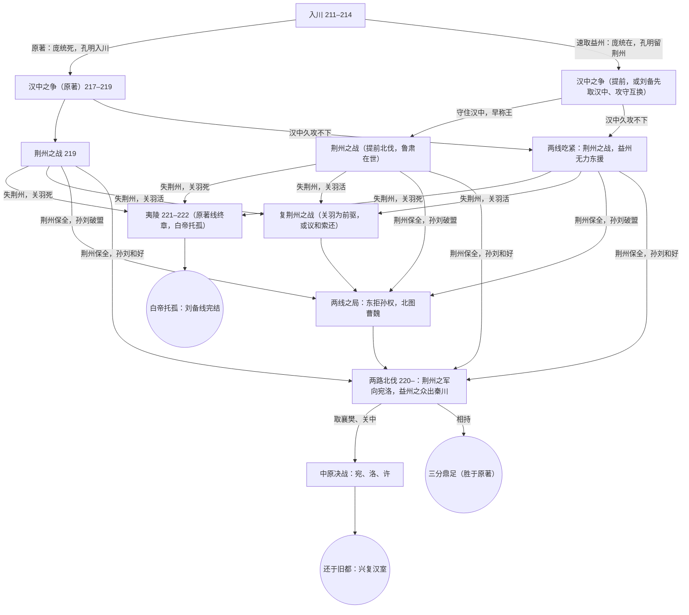

# AlterTale 路线图：刘备线

> 原著是世界在没有玩家干预时的默认轨迹。玩家改变的是因果条件，不是在固定分支之间挑选。

## 目标

玩家扮演刘备，在《三国演义》（毛宗岗本）的关键时刻做出决断。每个原著事件都带有前提：前提成立，事件照原著或以变形的方式发生；前提不成立，事件就失效，由人物按自身目标和所知做出替代行动。改动沿因果链传到后面的时代。比如关羽活着，"刘备伐吴"失去动机，夷陵之战可能根本不会出现。

基本原则：

- 以演义为准，人物性格、才智、武艺按演义；演义没写到的，才用史书补充。
- 推演只出事实（事件、状态、选项），说书另写文字，不得改动事实。
- 命令按驿程表传递，前方将帅按方略与授权自决，敌方有自己的谋划，但只能依其所知行事。
- 选项要贴合处境，不违背人物的立场底线；谋士按演义的性格进言。

## 已实现的机制

| 机制 | 做法 |
| --- | --- |
| 双轨制 | 原著开局带"原著节拍"（`canonPath`）：玩家一路照原著下令（选 ★、原著不发令时也不发令、或亲书的手令被判为与原著本质相同），推演照节拍走，只润色不改结果；第一道不同的命令起，本时代转入自由推演，不再回轨。一路照原著打完一个时代，其间数年照原著快进（`canonYears`），下一时代从原著开局接着走原著轨，不调模型。 |
| 原著事件池 | 每条带前提、原著结果、"若绕开"的走向和前置事件。原著事件是默认走向，不是必经之路：照原著做就照原著发生（成功的计策照样成功），绕开就失效，不得为拉回原路而设阻。已了结的不再核对，尚远的只列名字。 |
| 决断时刻 | 每回推演到下一个需要玩家拍板的时刻：决战或攻坚之前、要城得失之后、重要来使、主将阵亡或被擒、前方请命、上道命令已有分晓。粮草渐紧、敌军调动、小胜小败不算。终章从当下一直推到本时代定局。 |
| 谋士与选项 | 谋士顺着主公的意图出主意，替主公看破暗处，献计要有真实的成算并带上铺垫；每个选项附完整部署（`plan`）并注明是谁的主张（`by`）。奉命办事的人会把显而易见的配套做好。 |
| 复核 | 推演后由代码检查：人物移动快于驿程、坐镇者未奉命离任、俘虏未写脱身就换了地方。查出就带着问题重推一次。 |
| 评分 | 每个时代终章按时机、人物、地盘、兵马、民心、大势六项与原著结局相比，各 -15～15；总分 = 60 + 六项之和，原著 60 分及格，低于 60 即败局。 |
| 说书 | 只写推演定下的事；知道每个人此刻的处境；回目不用单字名、不重复诗句；夹杂的英文逐段改正。 |

## 时代

这一段是蜀汉的上升期。规则有两条：

- **比原著差，就结局。** 原著本身都没能兴复汉室，打得比原著还差，就不再续推，出战报收尾。每个时代写清"败局线"。
- **比原著好，后面的冲突不会消失，而是提前、推迟、变形，甚至攻守互换。** 这是要做深的部分。

所以时代不按固定年份排，而由**驱动力**触发：几股持续存在的力量（曹操争汉中、孙权取荆州……）在条件满足时爆发成一个时代。原著事件只是驱动力在原著条件下的一种样子。每个时代 6～8 回（入川 8、汉中 6、荆州 6），每回推进到下一个决断时刻。玩家可以连玩，也可以直接从任何一个时代开局，此时以原著状态为初始状态。

已完成：入川、汉中、荆州（含"孔明留守荆州"反事实开局），三段可以连打。夷陵未做（见"世界线"）。

### 驱动力

| 驱动力 | 发起方与目标 | 触发条件 | 原著中的样子 | 可能的变体 | 受哪些背景大事影响 |
| --- | --- | --- | --- | --- | --- |
| 刘备取益州 | 刘备：跨有荆益（隆中对） | 刘璋请刘备入川拒张鲁 | 入川，建安十六～十九年 | 用庞统上策速取；涪城席间擒刘璋；先结好刘璋北拒张鲁 | 马超渭南兵败（决定马超归属） |
| 曹操争汉中 | 曹操：保关中、威胁益州 | 汉中在张鲁或刘备手中，且曹操东线无大战 | 曹操取汉中（建安二十年），刘备再夺（建安二十四年） | 刘备先取汉中，曹操来攻，攻守互换；曹操被合肥牵制而推迟 | 张辽逍遥津、濡须之战（曹操是否腾得出手）；曹操病逝 |
| 孙权取荆州全境 | 孙权：据长江之险 | 荆州空虚，或孙刘边界之争激化；东吴主力不被合肥牵制 | 讨三郡、湘水划界（建安二十年）；白衣渡江（建安二十四年） | 讨地改为议和或和亲；偷袭提前或作罢；转攻长沙三郡而非江陵 | 鲁肃病逝（之前偏和，之后偏战）；吕蒙是否得势；合肥战事 |
| 曹魏保襄樊 | 曹操：守住南方门户 | 刘备军逼近襄樊 | 曹仁守樊城，于禁、庞德来援，徐晃解围 | 关羽提前北伐，于禁所部未必被水淹（水淹七军要秋雨汉水暴涨）；曹魏结吴更早或更晚 | 曹操病逝、曹丕继位 |
| 刘备北伐 | 刘备：兴复汉室 | 益州、汉中稳定，荆州在手 | 关羽北伐襄樊（建安二十四年） | 两路北伐（隆中对："荆州之军向宛洛，益州之众出秦川"）；趁曹操之死、曹丕篡汉出兵 | 曹操病逝、曹丕代汉、刘备称帝 |
| 刘备伐吴 | 刘备：复仇、夺回荆州 | 关羽死、荆州失；复仇动机压过劝谏 | 夷陵之战（章武元年～二年） | 不伐吴，转讨曹魏；伐吴但不连营 | 张飞之死；孙权受封吴王 |

驱动力的状态（是否活跃、蓄势多少、条件差几样）记在世界状态里，跨时代继承。推演每回检查各股驱动力：条件满足时，相应的冲突就开始，哪怕比原著早。

例一：用庞统上策速得益州，赶在曹操之前从张鲁手中取了汉中。"曹操争汉中"仍在，只是变成曹操来攻刘备据守的阳平关。原著事件随之变形："黄忠斩夏侯渊"的前提是夏侯渊出击，可能变成夏侯渊进攻时中伏；"鸡肋、杨修之死"的前提是久攻不下、粮运艰难，攻守互换后反而更容易成立。曹操若正在东线与孙权争合肥，也可能推迟来攻。

例二：关羽提前到建安二十一年北伐。东吴会不会来，看"孙权取荆州全境"的条件：鲁肃还在，更可能派人讨要三郡而不是偷袭；东吴主力若被合肥牵住，也无力两线作战；但关羽若把荆州抽空，而鲁肃恰在战事中途病逝，吕蒙接任，偷袭的风险立刻上升。曹魏一方也不同：春天进攻就没有秋雨、汉水暴涨，也就没有水淹七军。

### 时代与败局线

| # | 时代 | 演义回目 | 原著时间 | 每回约 | 触发（哪股驱动力） | 败局线（比原著差就结局） | 交给下一个时代的状态 |
| --- | --- | --- | --- | --- | --- | --- | --- |
| 1 | 入川 | 60～65 | 建安十六～十九年 | 2～4 个月 | 刘备取益州 | 刘备身死；或到建安二十年仍未得成都；或荆州失守而益州未得 | 是否得益州及用时；庞统生死；孔明是否入川；荆州留守的配置；马超归属；益州人心 |
| 2 | 汉中之争 | 70～73 | 建安二十二～二十四年（可提前） | 1～2 个月 | 曹操争汉中 | 汉中未得且益州北境受威胁；或丢失益州要地 | 汉中归属；法正、黄忠是否健在；是否称王；关羽是否北伐；关羽对五虎将之封的心结 |
| 3 | 荆州之战 | 73～77 | 建安二十四年秋起约半年（可提前） | 20 天～1 个月 | 刘备北伐，引出孙权取荆州全境、曹魏保襄樊 | 原著已是荆州尽失、关羽身死，再差就是益州也受波及，或刘备本人涉险 | 关羽生死；江陵、公安归属；孙刘关系 |
| 4 | 夷陵 | 81～85 | 章武元年～二年 | 1～2 个月 | 刘备伐吴（只在关羽死、荆州失时才可能出现） | 原著已是大败、刘备托孤 | 刘备生死；托孤；蜀吴关系 |

荆州之后，打得比原著好的局面，会由"刘备北伐"这股驱动力接续，例如两路北伐；具体时代等荆州之后再设计。

更早的时代先不做，以后再考虑：黄巾、徐州（陶谦让徐州、吕布夺徐州）、新野到赤壁（是否夺刘表的荆州、携民渡江）。

### 时代之间的过渡

时代之间往往隔着几年。这段时间不展开成完整时代，由推演快进：按背景大事、驱动力和人物目标概述其间发生的事，更新状态，必要时给玩家一两个关键决断；某股驱动力的条件一满足，就开下一个时代。原著里落在这些空档的、与刘备有关的事件，作为过渡中的决断点：

- 建安二十年，孙权讨荆州，单刀赴会，湘水划界（第 66 回）：还长沙等三郡 ／ 寸土不让 ／ 以别的条件换取和好。会影响"孙权取荆州全境"的蓄势，和鲁肃死后东吴对荆州的态度。
- 建安二十年，曹操取汉中后，是否趁其立足未稳立即北上（法正、黄权曾有此议）。若北上得手，"汉中之争"提前开打。

### 背景大事

有些大事主要由刘备之外的因素决定，大多数分支里都应该发生，除非前提被打破。按时代分组；做到哪个时代，就把那一组正式写进 `web/data/background.js`，逐条写清前提，并按回目校对。

入川期（211～214）：

| 事件 | 原著时间 | 前提与说明 |
| --- | --- | --- |
| 马超渭南兵败 | 建安十六年，第 58～59 回 | 曹操离间马超、韩遂。结果：马超后来投奔张鲁，是"马超归降"的前提 |
| 荀彧之死 | 建安十七年，第 61 回 | 荀彧反对曹操称公。结果：朝中再无阻力 |
| 濡须口之战 | 建安十八年，第 61 回 | 孙曹在东线对峙，东吴兵力被牵制 |
| 曹操进位魏公 | 建安十八年，第 61 回 | 曹操一步步走向代汉 |
| 伏皇后被杀 | 建安十九年，第 66 回 | 刘备讨曹的大义名分更足 |

汉中期（215～219）：

| 事件 | 原著时间 | 前提与说明 |
| --- | --- | --- |
| 曹操取汉中、张鲁投降 | 建安二十年，第 67 回 | 汉中时代的直接起因。刘备若早取汉中，此事失效 |
| 张辽威震逍遥津 | 建安二十年，第 67 回 | 东吴北上受挫，转而盯住荆州 |
| 曹操进位魏王 | 建安二十一年，第 68 回 | 与刘备进位汉中王相对照 |
| 鲁肃病逝 | 建安二十二年（史书补充） | 自然死亡。结果：东吴主张联盟的人去世，吕蒙接任，东吴对荆州转向强硬，是荆州时代的远因。玩家若在此前维护孙刘关系，转向的力度可以减弱 |
| 曹丕立为世子 | 建安二十二年，第 68 回 | 决定曹操死后由谁继位 |
| 耿纪、韦晃许都之乱 | 建安二十三年，第 69 回 | 汉室残余的最后反扑 |

荆州之后（220～223，已写入 `background.js` 的前五条）：

| 事件 | 原著时间 | 前提与说明 |
| --- | --- | --- |
| 曹操病逝 | 建安二十五年正月 | 头风、年老。可以因局势提前或推迟，但不会凭空消失 |
| 曹丕代汉 | 建安二十五年冬 | 曹操已死，曹氏掌握朝廷 |
| 刘备称帝 | 章武元年 | 汉帝被废；刘备拥有足够的地盘与名分 |
| 孙权受封吴王 | 章武元年 | 孙权向魏称臣。孙刘关系好的时候，可能不会发生 |
| 法正病逝 | 建安二十五年 | 自然死亡 |
| 黄忠之死 | 演义：夷陵中箭 | 夷陵之战不发生，就按年老另行安排 |
| 刘备病逝 | 章武三年 | 演义里是夷陵大败后悲愤成疾。不败，就可以推迟 |

病死这类事件要区分"自然原因"和"情节原因"。情节原因的前提不成立时，事件推迟或失效。

推演时，只把原著时间在开局之后、当前之后约四个月以内的背景大事交给推演核对；开局以前的视为已经发生，由跨时代继承或原著状态给出。

## 世界线（树状规划，草案）

每个时代的结局都会分叉，下一个时代是哪一个、以什么样子开局，由上一时代的结局决定。原著线只是这棵树上的一条路径；夷陵是原著线的最后一章，照原著打完，刘备就下线了。

任何一个时代总分低于 60，都直接结局：没能兴复汉室。

### 节点与分支怎么做

- **节点**是一个时代（地图、驿程、设定、人物、驱动力）。同一个时代的不同样子（例如汉中的"原著"与"攻守互换"）是它的不同开局，而不是另一个时代。
- **分支条件**写在时代配置的 `next` 里，改成一组候选，每个带条件，由代码按终局状态判定：城池归属（江陵是谁的）、人物存亡与所在（关羽是否在世）、孙刘关系（盟、和、破）。后两项靠终章交接一份结构化的"交接清单"，不再只靠文字概述。这也是"跨时代继承"结构化的第一步。
- **原著轨**只在原著路径上有；分支节点没有原著节拍，只有驱动力、背景大事和人物池，原著事件池换成"这股驱动力在此情形下可能的样子"。
- **背景大事**照常起作用：曹操病逝、曹丕代汉、刘备称帝、孙权受封吴王，各带前提，在分支上提前、推迟或失效。
- **评分**沿树累计：每个时代一份，终局按历代分数总评。

### 已定

1. **终局**：一点点来。现在取下长安（还于旧都的第一步）就算赢，北伐时代达成即为"胜局"。灭魏要很多个虚构时代，以后再说。
2. **收束**：刘备下线就结束。原著线打完夷陵，加一章白帝托孤，刘备下线（夷陵尚未写成）。其他路线：北伐到章武三年前后，刘备年老，未得长安就是三分之局；任何一段总分不及格即败局。所以有取长安获胜的线，但不会全赢：关中坚城、栈道粮运、曹魏反扑、东吴背盟，都会让北伐落空。
3. **分支节点的做法**：关键节点手写完整配置（北伐）；次要节点用模板（复荆州：沿用荆州的地图、驿程和人物，只写驱动力、胜负与参考开局，开局由过渡推演生成）。两种都先试一个，看效果再定。
4. **先做的一枝**：荆州保全 → 两路北伐。

### 现状

- 荆州的结局按 `next` 分支：江陵在手 → 两路北伐；关羽已死 → 夷陵（尚未写成）；其余（失荆州而关羽活）→ 复荆州。复荆州夺回江陵 → 两路北伐，否则 → 东西两线（尚未写成）。
- 终章交接清单 `handoff`（目前只有"孙刘：盟、和、破"），城池归属与人物存亡由代码从终局状态读出。
- 尚未写成的分支，结局页写明"接下来的世界线是……这一段还没有写成"。

## 人物池

人物池和事件池是推演的两根支柱：事件池告诉推演"原著里发生了什么、为什么"，人物池告诉它"这个人在新局面下会怎么做"。驱动力一旦提前或攻守互换，原著事件多半变形或失效，人物池就是推演的主要依据。

每个人物一张卡，跨时代共用，按时间分段：

| 字段 | 内容 | 例 |
| --- | --- | --- |
| 身份 | 势力、官职爵位、称谓、亲属关系，按年份变化 | 诸葛亮：军师中郎将（208）→ 军师将军（214）→ 丞相（221）→ 武乡侯（223） |
| 生卒 | 原著中的死亡事件，标明是自然原因还是情节原因 | 庞统：落凤坡（情节）；法正：病逝（自然） |
| 性格 | 按演义的口吻与行事风格 | 关羽：骄矜重义、轻视东吴、刚而自矜 |
| 才能 | 武力分档，谋略、统兵、政务、外交的高低，以及演义里的代表战例 | 关羽：武力第一档；统兵善水战；外交差 |
| 目标 | 长期志向与此刻所求 | 孙权：保江东、取荆州全境 |
| 底线 | 绝不会做的事 | 刘备：不联曹；关羽：不降 |
| 关系 | 恩义、心结、仇怨，会随事件改变 | 糜芳惧关羽治罪；孟达与刘封不和；关羽不服黄忠同列 |
| 所在与兵马 | 由时代状态记录，人物卡只给初始值 | — |

人物卡由手工起草、按回目校对，以后可以用语言模型从原文抽取、再人工审核。推演时只把本时代登场的人物卡放进提示词，以控制长度。

## 决策点（★ 为原著选择）

### 时代 1：入川

1. 涪城宴会（第 60 回）：庞统、法正劝你席间擒下刘璋。★不许 ／ 许，速取益州但失人心 ／ 先结好刘璋，北拒张鲁。
2. 庞统三策（第 62 回）：上策，精兵昼夜兼程直袭成都 ／ ★中策，假称回荆州，诱斩杨怀、高沛，夺涪关 ／ 下策，退还白帝，徐图进取。
3. 落凤坡（第 63 回）：庞统坚持分兵走小路。★同意 ／ 劝阻，大军同进 ／ 改派魏延先探路。
4. 召谁入川（庞统死后才会出现）：★召孔明、张飞、赵云 ／ 只召张飞、赵云，孔明留守荆州（就是现在 demo 里孔明线的起点）／ 只召孔明。
5. 处置刘璋：★迁往公安 ／ 留在成都优待。

入川已按这些决策点写成原著节拍（8 拍），见 `web/data/eras/ruchuan.js`。

### 时代 2：汉中（已完成）

原著节拍（6 拍，见 `web/data/eras/hanzhong.js`）：

1. 张郃犯葭萌：★遣黄忠、严颜二老将往拒 ／ 急调张飞自巴西往援 ／ 亲率大军北上。
2. ★依法正之计，亲率大军北取汉中，孔明同行。
3. ★令黄忠攻定军山，法正同往，先夺对山。
4. ★令黄忠劫曹军北山粮草，赵云接应。
5. ★依孔明之计，汉水疑兵，背水结营。
6. ★进位汉中王，以魏延镇守汉中。

原定的"东线方略"（是否令关羽北伐）没有单列，由荆州时代的开局继承。

### 时代 3：荆州（已完成）

谁留守荆州（由时代 1 继承，或直接选起点）、对关羽的授权、是否增援、如何对待东吴。原著开局的原著节拍是 6 拍"不另发令"。详见 `web/data/eras/jingzhou.js`。

### 时代 4：夷陵

入口前提：关羽已死、荆州已失、复仇动机压过劝谏。

1. 伐吴与否：★伐吴 ／ 听赵云、秦宓的劝谏，先讨曹魏（交给"刘备北伐"驱动力）／ 遣使议和，索还荆州。
2. 张飞（第 81 回）：★任其限期造白衣白甲 ／ 调张飞随中军 ／ 派人约束。
3. 进军方式：★舍舟就步，黄权屯江北 ／ 水陆并进 ／ 刘备坐镇白帝，交别人统兵。
4. 扎营（第 84 回）：★依山林连营七百里 ／ 退屯巫峡 ／ 集中扎营、速战速决 ／ 照马良所说，把营图送给孔明看。
5. 败后：★退守白帝 ／ 再战。

## 原著事件池

格式：事件 · 回目 · 前提（不成立就失效或变形）· 结果。

### 入川

| 事件 | 回目 | 前提 | 结果 |
| --- | --- | --- | --- |
| 斩杨怀、高沛，夺涪关 | 62 | 采用中策；二人起疑前来送行 | 刘备与刘璋公开决裂 |
| 庞统死于落凤坡 | 63 | 走中策路线；雒城未下；庞统走小路、骑白马；张任在小路设伏 | 庞统死，召援入川 |
| 张飞义释严颜 | 63 | 张飞率军入川，走江州一路 | 严颜归降，沿途关隘不战而下 |
| 擒杀张任 | 64 | 孔明入川设计；张任守雒城 | 雒城陷落 |
| 马超归降 | 65 | 马超在张鲁处；张鲁派他救刘璋；李恢前去说降 | 刘备得马超，成都震动 |
| 刘璋出降 | 65 | 成都被围、无援，马超在城下 | 刘备取益州，刘璋迁往公安 |

### 汉中

| 事件 | 回目 | 前提 | 结果 |
| --- | --- | --- | --- |
| 二老将夺天荡山 | 70 | 张郃南犯葭萌；黄忠、严颜往拒 | 张郃大败，天荡山屯粮被夺 |
| 黄忠斩夏侯渊 | 71 | 黄忠攻定军山；法正在对山举旗；夏侯渊出击而疲 | 夏侯渊死，曹军大溃 |
| 赵云汉水空营 | 71 | 曹操亲来，屯粮北山；黄忠劫粮被围，赵云接应 | 曹操疑而退走，曹军坠汉水者甚多 |
| 汉水疑兵、背水破曹 | 72 | 曹刘隔汉水对峙；孔明在军中 | 曹操屡败，刘备取南郑 |
| 鸡肋：杨修之死，曹操退兵 | 72 | 曹操久攻不下，粮运艰难 | 汉中归刘备 |
| 孟达、刘封取上庸 | 73 前后（据史书补） | 刘备已得汉中 | 上庸、房陵归刘备 |
| 刘备进位汉中王 | 73 | 刘备取汉中 | 封五虎将，魏延镇汉中 |
| 关羽不满五虎将之封 | 73 | 黄忠与关羽同列 | 费诗劝解；关羽心结埋下 |

张飞瓦口关破张郃（第 70 回）放在入川到汉中之间的快进里。

### 荆州

见 `web/data/eras/jingzhou.js` 中的原著事件池（12 条）：水淹七军、刮骨疗毒、白衣渡江、士仁与糜芳献城、徐晃解围、刘封孟达拒援、军属攻心、败走麦城、关羽被擒杀等。

### 夷陵

| 事件 | 回目 | 前提 | 结果 |
| --- | --- | --- | --- |
| 刘备伐吴 | 81 | 关羽死、荆州失；复仇动机压过劝谏 | 时代开始 |
| 张飞遇害 | 81 | 张飞急于复仇、限期苛责；范疆、张达受鞭挞被逼到绝路 | 张飞死，刘备更急于复仇 |
| 黄忠中箭而死 | 83 | 黄忠出战，马忠设伏 | 黄忠死 |
| 陆逊拜大都督 | 83 | 吴军连败；阚泽力荐 | 吴军改为坚守不战 |
| 连营七百里 | 84 | 夏季炎热；舍舟就步；依山林结营 | 火攻的前提成立 |
| 火烧连营 | 84 | 连营成立；陆逊坚守待时；马良的劝谏没被采纳 | 蜀军大败 |
| 八阵图困陆逊 | 84 | 刘备败走；孔明预先在鱼腹浦布下石阵 | 陆逊退兵 |
| 黄权降魏 | 85 | 黄权在江北，归路被断 | 黄权降魏 |
| 白帝托孤 | 85 | 大败后病重 | 刘备线结束 |

## 引擎（进度）

1～3、6、7 已完成；4、5 做了一半。

1. **人物池**：人物卡跨时代共用（见上），由代码按年份取出当时的官爵、称谓与关系，替代现在写在世界设定里的人物说明、称谓表、武力分档与立场底线。
2. **时代配置**：每个时代一份数据，包括时间窗、地点与驿程、人物、兵马、开局、决策点、原著事件池、立场底线、入口条件。荆州 demo 先改造成这种形式。
3. **事件池结构化**：每个原著事件有编号。推演每回对时间窗内的事件逐一报告：已发生、变形发生、失效、尚未到时，并写明原因。战报里加"原著对照"一栏。
4. **跨时代继承**（做了一半）：一个时代结束时，代码整理出要交给下一个时代的状态（人物生死与所在、城池归属、各方关系，以及人物卡里变化了的心结与恩怨），用来生成下一个时代的开局。直接从某个时代开局时，使用原著状态。现在由过渡推演按上一局的终局状态用文字改写开局；结构化的"交接清单"与世界线分支一起做。
5. **驱动力、过渡与败局**：驱动力的状态写进世界状态并跨时代继承；时代由驱动力触发，可以提前或推迟，攻守可以互换；时代之间由推演快进过渡；每个时代有败局线，比原著差就结局。时代配置里的固定时间窗，改为"触发条件 + 大致时长"。（做了一半：败局线与评分、过渡已有；时代仍按固定时间开局，提前或攻守互换只体现在过渡改写的开局里。）
6. **回归测试**：每个决策点都选 ★，测试脚本自动跑，检查原著事件是否大致复现。复现不了，就说明前提写错了。有了原著轨以后，三个时代连打的回归都能完整复现。

## 测试

由便宜到贵：

1. `node tools/check.js`：不调模型。检查时代配置是否自洽，重放 `tools/fixtures` 和 `playtest-out` 里的全部对局（生成提示词、重新解析、复核命中），检查各样本走的是照原著快进还是推演过渡。改代码后先跑它。
2. `node tools/playtest.js --from tools/fixtures/<样本>.json --continue --turns 1`：从上一时代的终局样本出发，只跑一次过渡和下一时代的第一回，约 0.4 美元。测时代衔接用这个。
3. `node tools/playtest.js --era <时代> --starts canon --strategies canon --player-model sonnet [--continue]`：原著回归。整条链约 4～5 美元，只在大改动后跑。
4. `--strategies script --script "命令1|命令2"`：前几回按脚本下令，测某条特定的打法（模拟玩家不一定照人设玩，测"贪功"之类要用脚本）。

推演用 Sonnet；Haiku 5.5 便宜十倍以上，但会乱用原著惯性、人物瞬移、违反驿程，暂不用于推演。
7. **背景大事**：贯穿所有时代的大事清单，各带前提，可以提前、推迟或失效。

## 里程碑

1. ~~**框架**~~（完成）：人物池、时代配置、事件池结构化、战报"原著对照"、回归测试。
2. ~~**入川**~~（完成）：跨时代继承；双轨制；决断时刻；谋士与复核。
3. ~~**汉中之争**~~（完成）：三段连打；照原著快进；评分。
4. **世界线**：先定下树的形状与终局（见"世界线"一节的待定问题），把 `next` 改成带条件的多分支，加上结构化的交接清单；然后做第一枝，建议"荆州保全 → 两路北伐"。夷陵作为原著线终章，排在后面。
5. 以后：更早的时代（黄巾、徐州、新野到赤壁），以及诸葛亮线（南征、街亭、子午谷）。
6. 以后：扮演其他人物，如关羽、曹操、孙权、吕蒙。同一个时代换一个视角：玩家只知道这个人物知道的事，命令只能从他所在的地方发出，他的上级（例如关羽之于刘备）也成为一个按人物卡行事、会下令和问责的角色。人物池、驿程和情报延迟都可以直接复用；需要补的是各势力自己的决策点、谋士和立场底线。
